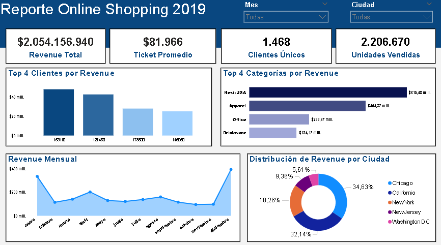

## Análisis de Online Shopping 2019

**Dataset:** Online Shopping Dataset, publicado en Kaggle por Jackson Divakar R.

**Link:** https://www.kaggle.com/datasets/jacksondivakarr/online-shopping-dataset.

Análisis de los datos crudos de las ventas de un Shopping Online durante todo el año 2019, con el objetivo de comprender las tendencias y patrones más importantes de la empresa, como por ejemplo, el rendimiento de ingresos o el comportamiento de los clientes.

**Herramientas Utilizadas:** SQL y Power BI.

## Insights

- **Revenue Total de $2.05 Billones**, una cifra impulsada por un modelo de ventas de alto volumen.

- Se confirmó que el **Ticket Promedio** es de **$81.966**, un valor muy elevado, lo que indica transacciones con múltiples unidades por pedido y un modelo de negocio orientado a la venta mayorista.

- **Chicago y California generan el 66.7% de las ventas totales**, y existe posibilidad de crecimiento en **New York**. 

- **Con $615.48M, Nest-USA** fue la línea de productos mas destacada, superando por más del doble a categorías como Office (productos de oficina) y Drinkware (categoría bebidas).

* **El Principal Hallazgo:** El gráfico de Revenue Mensual muestra sus picos más altos en enero y diciembre. Inmediatamente despues, en febrero, se observa una caída drástica en el volumen de las ventas, de un **65.6%** en tan solo 30 días, **pasando de $335M a $115M**.

## Recomendaciones Estratégicas

- Se recomienda realizar campañas focalizadas en **New York**, ya que representa el **18.26%** del revenue total, teniendo un alto potencial de crecimiento. 

- Implementar promociones agresivas en febrero, con el fin de moderar el descenso en las ventas respecto a enero.

- Los clientes de **IDs 153110 y 127480** tuvieron un gran impacto en en el revenue total. Se recomienda priorizar la fidelidad de estos clientes a largo plazo.

- Disponibilidad constante de los productos **Nest-USA**, y utilizar su alta demanda para impulsar categorías con menor volumen de ventas.

## Datos y Pasos Realizados

**Dataset:** Se trabajó con un dataset el cual, luego del proceso de limpieza y transformación de datos, consta de unos 48.107 registros. Cabe recalcar que los valores NULL y los registros duplicados no fueron tenidos en cuenta a la hora de realizar el análisis. Los campos que se usaron fueron:

CustomerID, Location (ciudades), Transaction_ID, Transaction_Date, Product_Category, Quantity y Avg_Price.

La variable Gender (género) se mantuvo en el modelo, pero fue excluida de los reportes finales para priorizar métricas con mayor impacto en la toma de decisiones.

**Procedimiento:** El estudio se realizó mediante la ejecucion de consultas SQL para extraer y verificar métricas de rendimiento, las cuales fueron recreadas con medidas DAX en Power BI, herramienta donde se llevó a cabo el modelado final de datos y el diseño de las visualizaciones.
